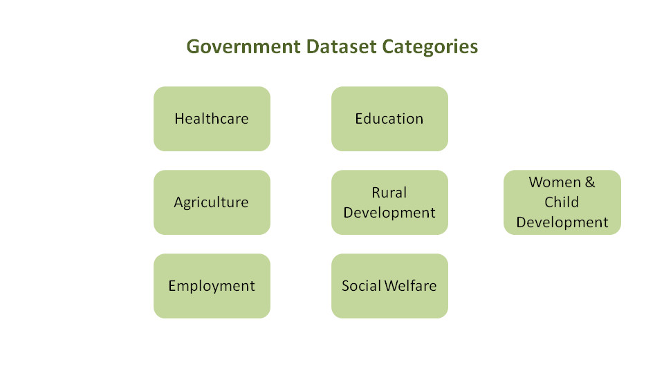
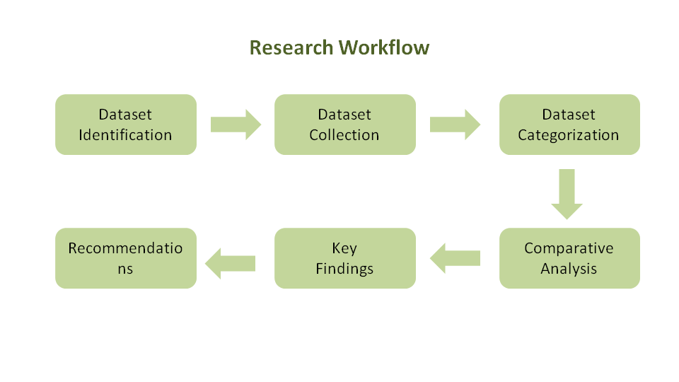
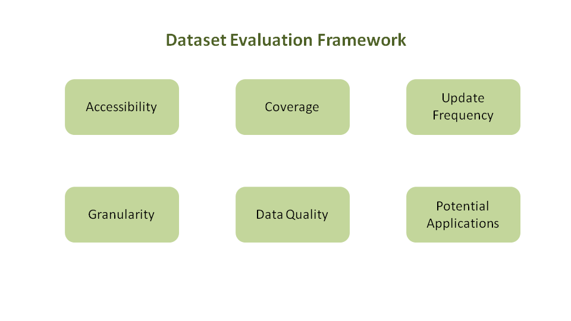

# Indian Open Government Dataset Analysis

## Open Government Datasets for Social Sector Problem Solving in India

This repository contains an independent research report analysing publicly available Indian government datasets relevant to solving social-sector challenges. The report evaluates dataset accessibility, coverage, update frequency, granularity, and potential applications across multiple development sectors.

The study also discusses current limitations in India's open data ecosystem and identifies opportunities for future research and AI-driven public policy solutions.

---

## Dataset Categories



---

## Research Workflow



---

## Dataset Evaluation Framework



---

## Objectives

- Identify important social-sector datasets.
- Compare dataset availability.
- Evaluate accessibility and usability.
- Analyse update frequency.
- Study dataset limitations.
- Identify opportunities for AI and data-driven governance.

---

## Sectors Covered

- Healthcare
- Education
- Agriculture
- Rural Development
- Women & Child Development
- Employment
- Social Welfare

---

## Repository Structure

```
Indian-open-government-dataset-analysis/
│
├── README.md
├── Open_Government_Datasets_for_Social_Sector_Problem_Solving_in_India.pdf
├── LICENSE
├── .gitignore
│
├── images/
│   ├── 01_dataset_categories.png
│   ├── 02_research_workflow.png
│   └── 03_dataset_evaluation_framework.png
│
└── references/
    └── sources.md
```

---

## Future Work

Possible future extensions include:

- Automated dataset quality assessment
- Metadata analytics
- Dataset benchmarking
- Open data maturity index
- AI-ready government datasets

---

## Author

**Mehak Rai**

Independent Research Project